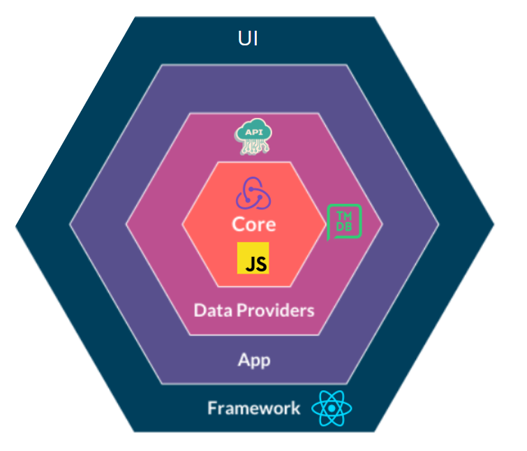
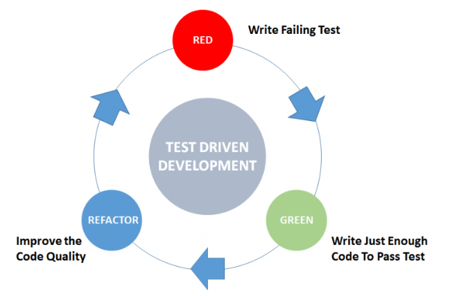

# Architecture

## Core / Domain

In the Core which is the brain of my application i used Redux tool kit to reduce the boiler plate code that is present in the core Redux library, and ES6 vanilla javascript. the different actions and selectors enable us to comunicate with UI thanks to the React-redux provider that wraps our App component.

## Services/ Infrastructure

I made a class that manage all the api calls and also some data formating.
Indeed this class communicate with core of the application provides it the data when it needs it.

## FrameWork / Library /UI

I used the last version (18) React js to build the Ui of the application each component are either pure component that displays data received by props or component that display data received by useSelectors and/or dispacth actions received by useDispatch

### Architecture of a component

a component is usually pout in a folder name after it and has 3 files Component.test.js (for testing),Component.jsx(the component itself), Component.module.scss(for styling).

## Conclusion

Why i setup this architecture ?

Because "separation of concern" is a key software principle and thanks to it we can make our application more flexible actually because we separate the buissness logic from the GUI we are not coupled with the framework/library (in that case react) wich is really handy in case of a futur migration. that also facilitate the testatbility of our product owing to the fact that all the layers know nothing about each other.

# Workflow

## TDD (Test Driven Development)

## Library used

To help me write my test i used plain old jest in the core of my application and react testing library to help me replicate the rendering of my component in the virtual DOM and his behavior, i also used jest to write my assertions.

i choose react-testing-library for my react component because it enable us to test our application the way the user experience it and not the actual implementation.

### Mocking

To mock my API calls i used Mock Service Worker(MSW) because like react-testing-library my test are not glued by the implementation(axios,fetch ect...) since msw mock by intercepting requests on the network level. i used axios for my api calls but i can replaced it with fetch and it will not break my test, that is the biggest advantage of msw.

## Why use TDD in frontend development

Traditionally TDD is not often used in frontend development so why i used tdd in this project ?

1. "TDD slow down the development process", it's true in a short term point of view. Nonetheless in a mid and long term the development process is faster with tdd for the reason that i'm becoming faster as i practice it, when i write pure logic i don't need or rarely need to go back and forth between my browser and my IDE and use console.log or the debugger because the tests help me catch bugs, and point me in the right direction like a GPS.

2. I don't need to test manually my application all the time.

3. My code is much more shorter and elegant thanks to the continious refactoring.

4. I trust more my code, i'm not afraid to break something when i add a new feature to my project or when i refactor a function that already exists.

5. TDD helps me in the design of my application, in reality the tests are just a side effects of TDD, the real value is in the guidance of writing my intention before wrinting any production code and the countinuous feedback.

I surely forgot to mention some advantages of this workflow and there are surely other advantages that i'm not even aware of.

# Getting Started with Create React App

This project was bootstrapped with [Create React App](https://github.com/facebook/create-react-app).

## Available Scripts

In the project directory, you can run:

### `npm start`

Runs the app in the development mode.\
Open [http://localhost:3000](http://localhost:3000) to view it in your browser.

The page will reload when you make changes.\
You may also see any lint errors in the console.

### `npm test`

Launches the test runner in the interactive watch mode.\
See the section about [running tests](https://facebook.github.io/create-react-app/docs/running-tests) for more information.

### `npm run build`

Builds the app for production to the `build` folder.\
It correctly bundles React in production mode and optimizes the build for the best performance.

The build is minified and the filenames include the hashes.\
Your app is ready to be deployed!

See the section about [deployment](https://facebook.github.io/create-react-app/docs/deployment) for more information.

### `npm run eject`

**Note: this is a one-way operation. Once you `eject`, you can't go back!**

If you aren't satisfied with the build tool and configuration choices, you can `eject` at any time. This command will remove the single build dependency from your project.

Instead, it will copy all the configuration files and the transitive dependencies (webpack, Babel, ESLint, etc) right into your project so you have full control over them. All of the commands except `eject` will still work, but they will point to the copied scripts so you can tweak them. At this point you're on your own.

You don't have to ever use `eject`. The curated feature set is suitable for small and middle deployments, and you shouldn't feel obligated to use this feature. However we understand that this tool wouldn't be useful if you couldn't customize it when you are ready for it.

## Learn More

You can learn more in the [Create React App documentation](https://facebook.github.io/create-react-app/docs/getting-started).

To learn React, check out the [React documentation](https://reactjs.org/).

### Code Splitting

This section has moved here: [https://facebook.github.io/create-react-app/docs/code-splitting](https://facebook.github.io/create-react-app/docs/code-splitting)

### Analyzing the Bundle Size

This section has moved here: [https://facebook.github.io/create-react-app/docs/analyzing-the-bundle-size](https://facebook.github.io/create-react-app/docs/analyzing-the-bundle-size)

### Making a Progressive Web App

This section has moved here: [https://facebook.github.io/create-react-app/docs/making-a-progressive-web-app](https://facebook.github.io/create-react-app/docs/making-a-progressive-web-app)

### Advanced Configuration

This section has moved here: [https://facebook.github.io/create-react-app/docs/advanced-configuration](https://facebook.github.io/create-react-app/docs/advanced-configuration)

### Deployment

This section has moved here: [https://facebook.github.io/create-react-app/docs/deployment](https://facebook.github.io/create-react-app/docs/deployment)

### `npm run build` fails to minify

This section has moved here: [https://facebook.github.io/create-react-app/docs/troubleshooting#npm-run-build-fails-to-minify](https://facebook.github.io/create-react-app/docs/troubleshooting#npm-run-build-fails-to-minify)
